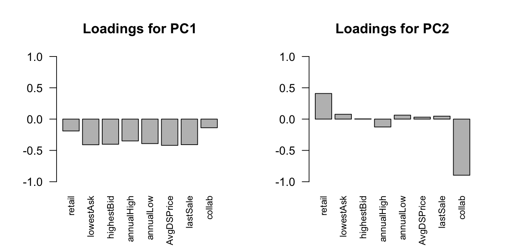
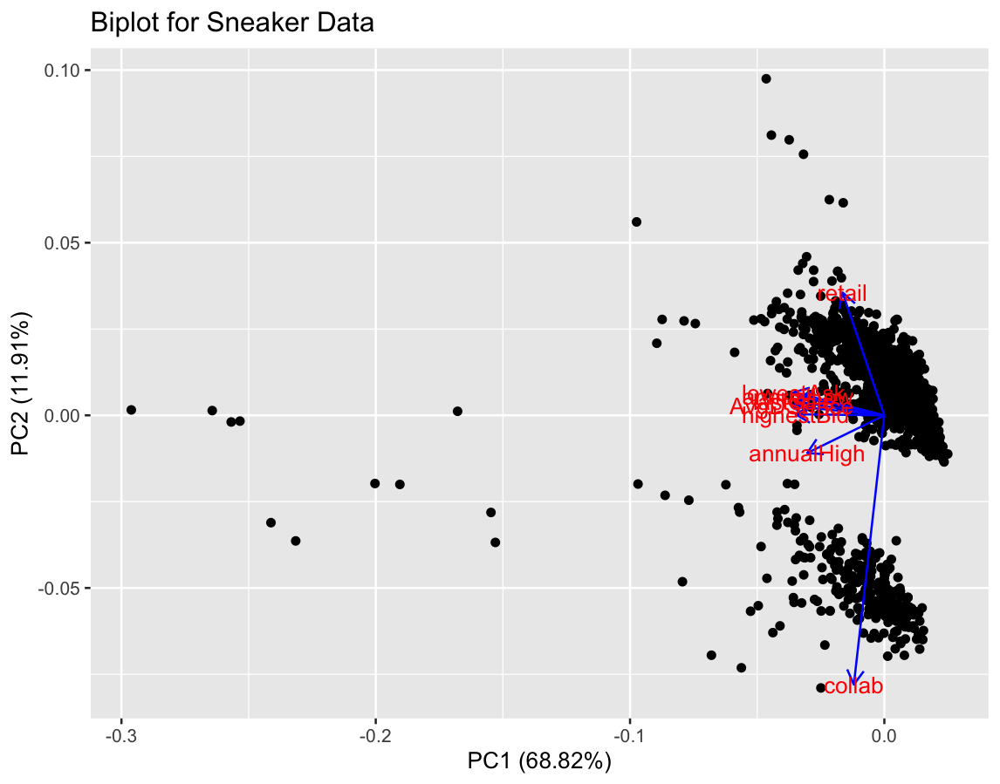

# Methodology 

## Data Preprocessing 

Before any statistical analysis, the following steps were taken to prepare the data for analysis: 
  1. **Feature Engineering**:
  - Created `jordan.type` variable to identify the specific model of Jordan sneaker. N/A values were assigned to non-Jordan sneakers 
  - Created `collab` variable to indicate whether sneakers were apart of a collaboration between brands
  2. **Encoding `collab` Variable**:
  - The `collab` variable was converted to numeric to allow for inclusion in principal component analysis. Sneakers apart of collaborations were assigned a '2' and sneakers that are not apart of a collaboration received a '1'
  3. **Subsetting Data**:
  - A subset of the original dataset was created which only included 'Nike' brand shoes. This was done in preparation for exploratory data analysis and was named `sneakers.nikes`
  - A subset of the original dataset was created which only included the most frequently occurring brands in the dataset. These are 'Nike', 'Nike SB', 'Nike Dunk', 'Nike AF1', 'Jordan', 'adidas', 'Yeezy', and 'New Balance'. This was done in preparation for exploratory data analysis and was named `sneakers.brands`
  - A subset of the original dataset was created which only included quantitative variables. These are `retail`, `lowestAsk`, `numberOfAsks`, `salesThisPeriod`, `highestBid`, `numberOfBids`, `annualHigh`, `annualLow`, `volatility`, `deadstockSold`, `pricePremium`, `AvgDSPrice`, `lastSale`, `collab`. This was done in preparation for principal component analysis and was named `sneakers.quant`  

## Exploratory Data Analysis (EDA) 

I conducted exploratory data analysis univariately to view distributions of both quantitative and categorical variables in the data. 

  - **Univariate Analysis**
    - Histograms were created to observe the distributions of six quantitative variables in the data.
      
    - Barplots were created to observe the frequency of categorical variables in the data.
      

## Statistical Modeling 

Multiple statistical models were applied to identify the most important factors influencing sneaker resale prices, as well as to analyze trends and associations between similar sneakers on the resale market. 

### a. Principal Component Analysis 

  - **Goal**: The goal of PCA is to reduce the dimensionality of the data to observe the variables that best explain trends and patterns within the data.
  - **Implementation**:
    - PCA was implemented on the subset of data containing only the quantitative variables in the data, `sneakers.quant`.
    - The `collab` variable was treated as numeric, which is further explained in the Data Preprocessing section of this project.
    - The data was standardized in implementing PCA to ensure the variables were measured on an equal scale.
    - Principal Component Regression was performed using the first two principal components, in which `AvgDSPrice` was chosen as the dependent variable. 
  - **Results**:
      - A screeplot and cumulative proportion of variance plot were created to determine an appropriate number of principal components. Based on these plots, The first two principal components explain approximately 80% of the variance in the data. Thus, I chose to utilize 2 principal components in this analysis.
        

          
          
        

      - Barplots containing the loadings for the first two principal components were created in order to determine which variables contribute most to each component. Based on the barplots and loadings, Average DeadStock Price, Last Sale Price, and Lowest Ask Price are loaded high for the first component. The collaboration and retail price variables are loaded high for the second principal components.
 
        
        
      - A biplot plotting the data points with the first two principal components on the axes was created to visualize the loadings and significance of the variables' contributions to each principal component. The plot shows that `AvgDSPrice`, `lastSale`, and `lowestAsk` are loaded high for the first principal component, along with `collab` and `retail` loaded high for the second principal component.
   
        

### b. K-Means Clustering 

  - **Goal**: The goal of k-means clustering is to partition the data based on the variables using a step-wise approach into non-overlapping groups.
  - **Implementation**:
     - K-means clustering analysis was implemented on a subset of the data containing only quantitative variables, `sneakers.quant`
     - A plot using the CH-Index to measure between-cluster variation was created to determine the optimal number of clusters
  - **Results**:
     - The between-cluster variation plot utilizes the CH-Index to determine the optimal number of centers (or clusters) to use when implementing k-means clustering. Based on this plot, the CH-Index reaches its largest value when utilizing 4 clusters. Thus, I chose to use 4 centers in k-means cluster analysis.
       
         
         
     - K-means clustering utilizing 4 centers was applied to the dataset and plotted with the first two principal components on the axes. Based on the plot, it appears that the first principal component was most influential in determining cluster assignment for this data. The plot does have some overlapping clusters, but this is minimal in comparison to utilizing a different number of centers or clusters. Thus, utilizing 4 clusters seems reasonable in clustering this data. 

         

      
