---
layout: default
title: Results
--- 

# Results 

## 1. Exploratory Data Analysis 

A more specific exploratory data analysis was conducted in addition to the simple EDA described in the methodology section. This additional EDA aims to analyze the association of the `brand`, `jordan type` and `collab` variables with increased prices on the resale market. 

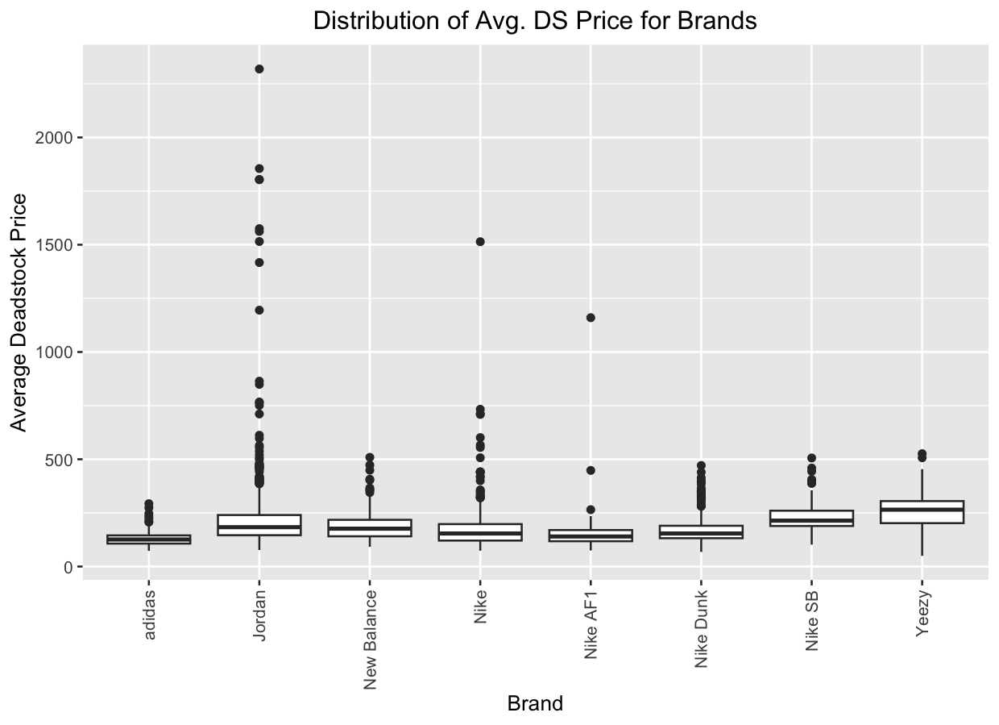 

The boxplot displays the distribution of average deadstock price for each frequently occurring brand in the dataset. This plot suggests that Yeezy, Jordan, and Nike SB sneakers are most highly associated with increased prices on the resale market. 

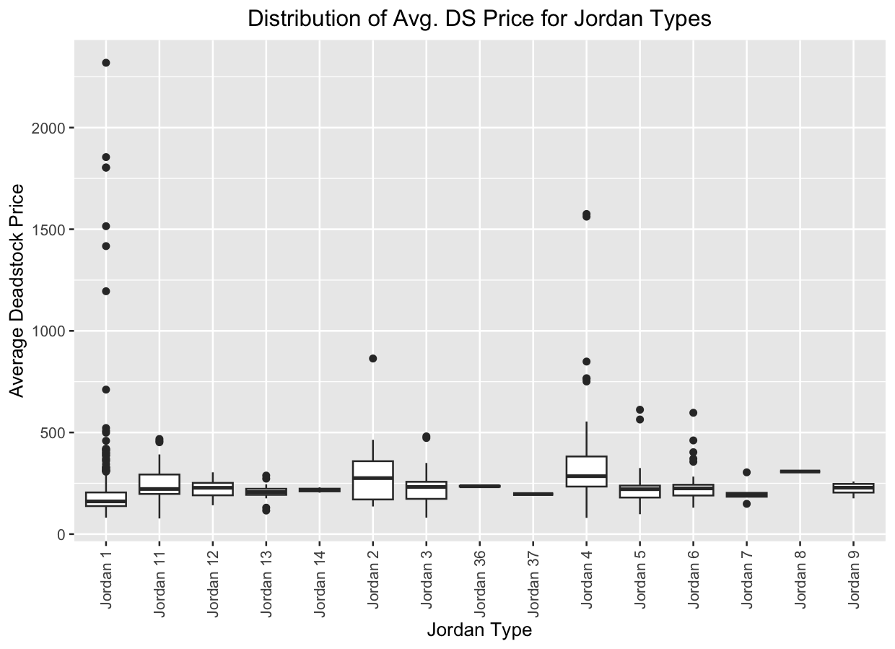 

The boxplot displays each Jordan sneaker's distribution with respect to the average deadstock price. This plot reveals that Jordan 4 and select Jordan 1 sneakers are significantly different than others in association with increased resale prices. 

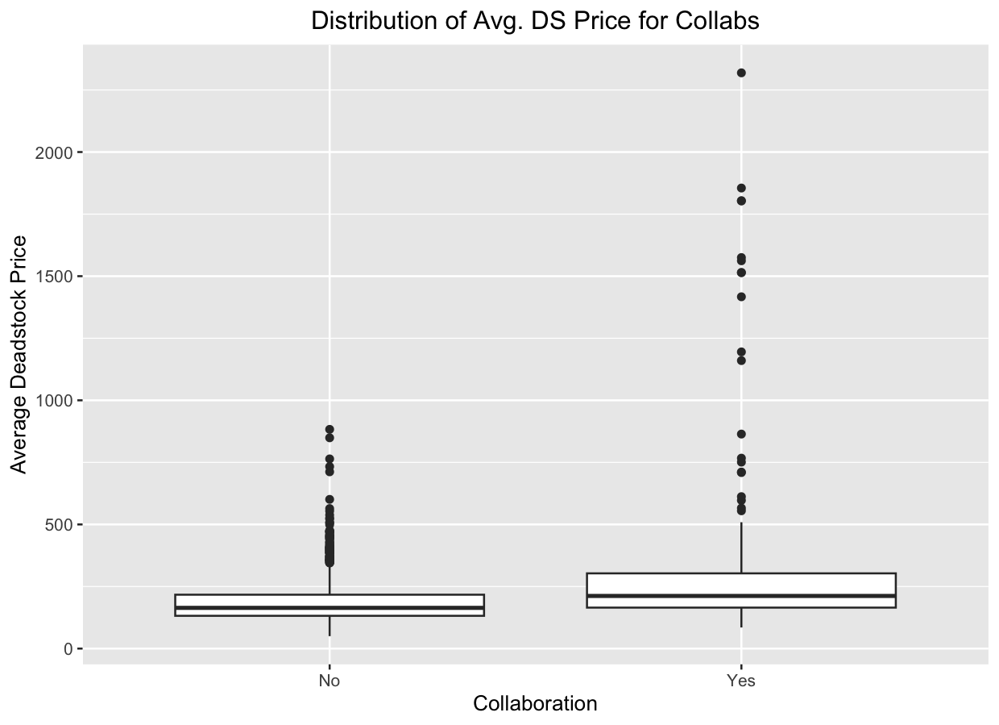 

The boxplot displays the distribution of the collaboration indicator variable with respect to the average deadstock price. This plot further illustrates that sneakers produced in collaboration with other brands are generally associated with increased resale prices. 

## 2. Principal Component Analysis Results 

Principal Component Analysis was used to reduce the dimensionality of the data to analyze key variables that explain trends and patterns within the data. 

### a. Screeplot and Cumulative Proportion of Variance plot  

A screeplot and cumulative proportion of variance plot were created to determine an appropriate number of principal components. Based on these plots, The first two principal components explain approximately 80% of the variance in the data. Thus, I chose to utilize 2 principal components in this analysis.

  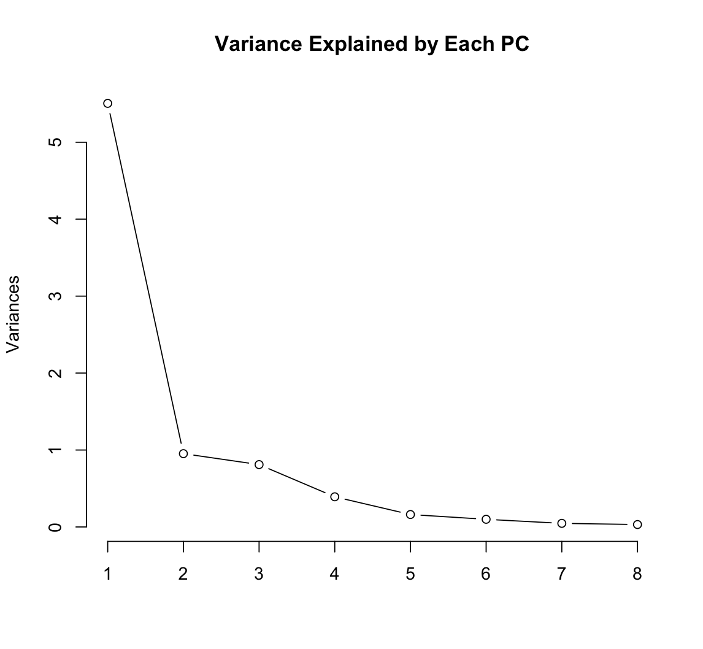
  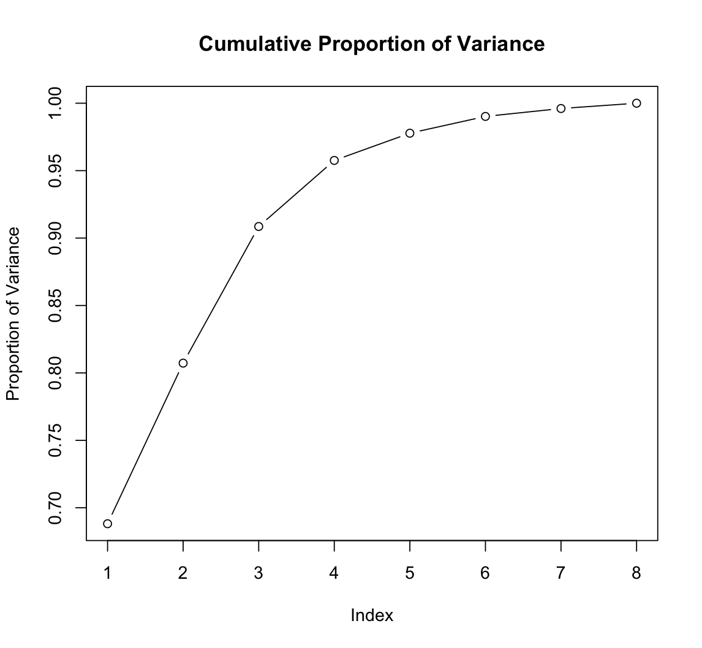

### b. Loadings for 2 Principal Components  

Barplots containing the loadings for the first two principal components were created in order to determine which variables contribute most to each component. 

  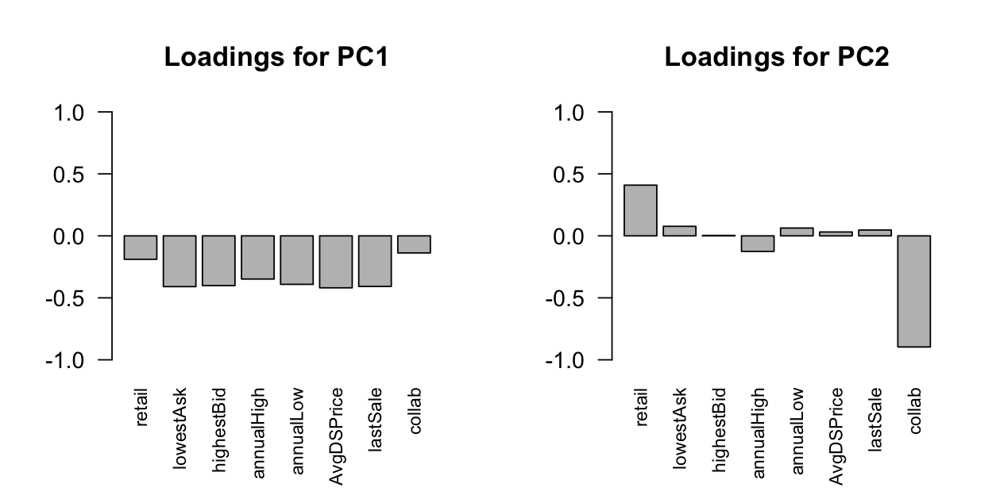

The first barplot displays the loadings for the first principal component, which shows Average DeadStock Price, Last Sale Price, and Lowest Ask Price are loaded high for PC1. The second barplot displays the loadings for the second principal component, which shows that Collaboration and Retail Price are loaded high for PC2. 
        
### c. Biplot for Two Principal Components  

A biplot plotting the data points with the first two principal components on the axes was created to further visualize the loadings and contributions of each variable to the first two principal components.  

  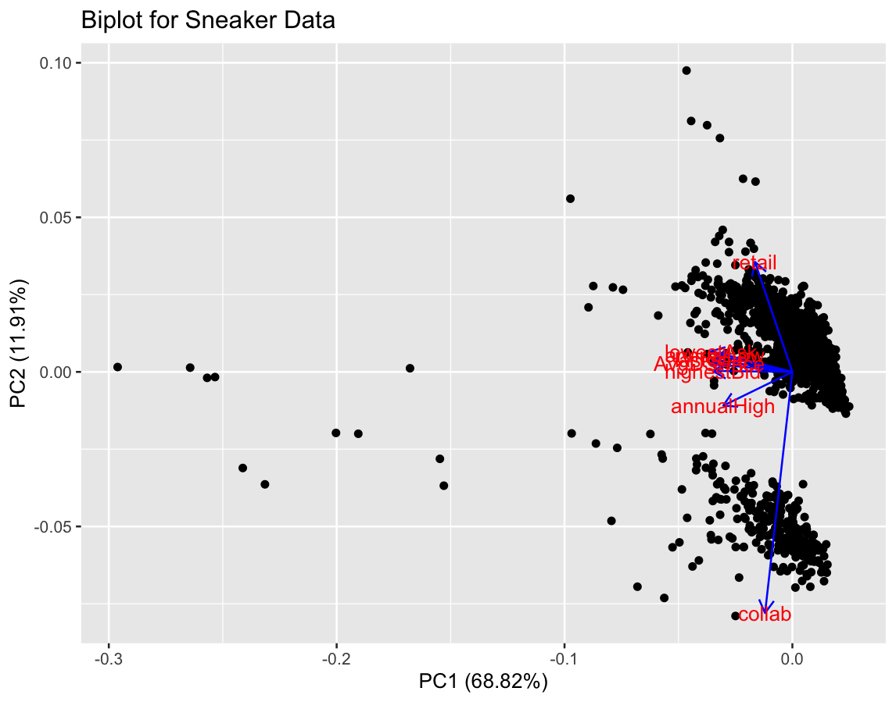 

The biplot further shows that `AvgDSPrice`, `lastSale` and `lowestAsk` are loaded high for the first principal component. It is also important to recognize the cluster of variables loaded similarly for the first principal component, which includes variables such as `annualHigh` and `highestBid`. Thus, this indicates that these variables, while not as important in contribution to the first principal component, may be highly correlated with each other. The biplot further shows that the `collab` and `retail` variables are loaded high for the second principal component. It is important to notice the difference in direction that these variables are loaded, where `collab` is loaded highly negatively and `retail` is loaded positively. This suggests that these two variables, while both contributing greatly to the second principal component, are likely not correlated with each other. 

### d. Biplot to Detect Collaboration 

Based on the biplot's visualization of each variables' loadings for the first two principal components, a biplot was created to visualize the difference in collaboration within the data. 

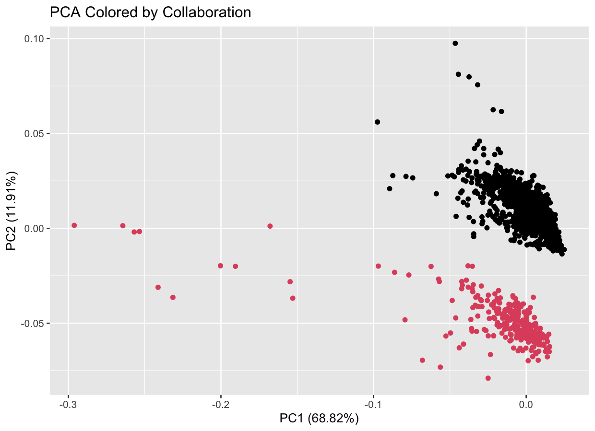 

The biplot is colored by collaboration variable, with black data points indicating the sneaker is not apart of a collaboration and red indicating a collaboration. The figure displays a clear distinction between these two groups with respect to the second principal component, which further illustrates the collaboration variable's importance in explaining the variation in this data.  

### e. Correlation Matrix 

Based on the potential associations between the variables shown in the biplot, a correlation matrix was created to further analyze the possible correlations between the quantitative variables in the data. 

   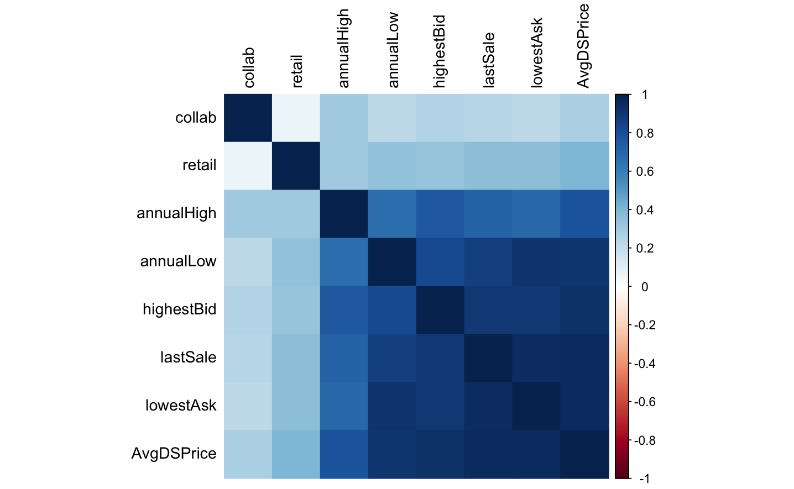 

In the correlation matrix, a stronger shade of blue represents a stronger, positive, correlation between variables, and lighter shades represent weaker (but still positive) correlations. The lightest shades of blue (almost white) represent a correlation of 0 between variables, or no association. Analyzing the potential relationships between variables, as indicated in the biplot, reveals a strong correlation between the `annualHigh` variable and both the `highestBid` and `AvgDSPrice` variables. Furthermore, there is a strong correlation between the `annualLow` variable and both the `lowestAsk` and `AvgDSPrice` variables. `lastSale` is highly correlated with the `lowestAsk` and `AvgDSPrice` variables. All of these correlations, with some stronger than others, are positive associations. Lastly, the correlation matrix reveals that the `collab` and `retail` variables have a correlation coefficient equal to zero, or that there is no correlation between these variables. 

## 3. Principal Component Regression 

Using the results obtained by applying Principal Component Analysis on the quantitative variables in the data, Principal Component Regression was implemented to determine and quantify the effects of each principal component on a dependent variable, being the `AvgDSPrice` variable. The results obtained from this regression can be seen in the table below. 

   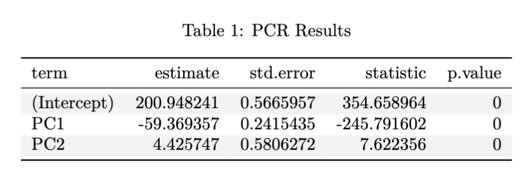 

The intercept term is 200.948 dollars, which is the price we expect if both PC1 and PC2 are zero, and is statistically significant at the 5% level. Principal Component 1 has a coefficient of -59.369 dollars, which is the average change in expected price for a one unit increase in the first principal component. This result is statistically significant at the 5% level. Principal Component 2 has a coefficient of 4.426 dollars, which is the average change in expected price associated with a one unit increase in the second Principal Component, and is also statistically significant at the 5% level. Based on these results, we can reasonably conclude that sneakers with higher retail prices and those that are apart of a collaboration are associated with higher prices on the resale market. 

## 4. Clustering Analysis 

Clustering analysis was implemented in two ways on this data. The first, being k-means clustering, utilizes a step-wise approach to partition the data into groups. The second, being hierarchical clustering, groups the observed data into clustering based on a predetermined linkage function. 

### a. K-Means Clustering 

K-means clustering utilizes a step-wise approach over many iterations to determine an optimal clustering of the data, based on a pre-specified number of centers, or clusters. 

#### I. **Optimal Number of Centers (Clusters)**:  

The Between-Cluster variation plot utilizes the CH-Index to determine the optimal number of centers (or clusters) to partition the data when using K-Means clustering. 

   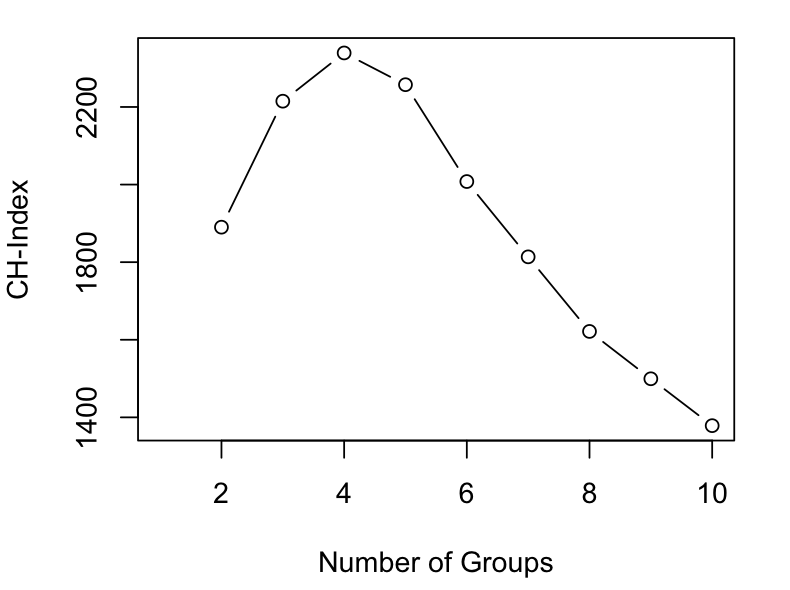    

The CH-Index obtains a maximum value when utilizing 4 groups, or clusters, thus indicating that this is the optimal number of centers to use in applying K-Means Clustering. 

#### II.**K-Means Clustering with 4 Centers**:  

K-Means clustering implemented utilizing 4 centers, or groups, and was iterated over 100 runs to converge to an optimal grouping of the data based on these centers. 

   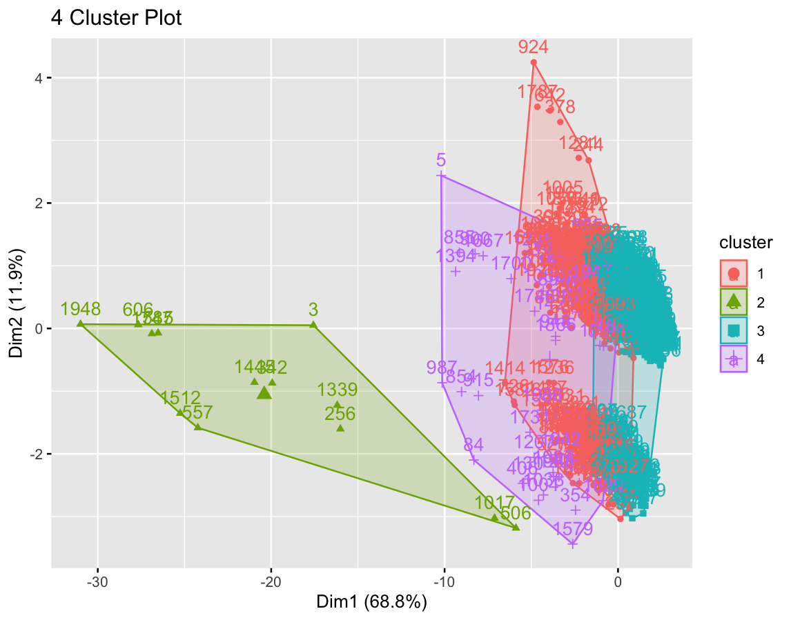 

The above figure plots each data point grouped in its cluster assignment, which is specified through the color of its point, and is plotted with the first two principal components on the axes. Based on the figure, it appears that the first principal component was most influential in determining the cluster assignment for each observation in the data. However, the second cluster does appear to contain some variation in the observations' values for the first principal component, indicating that these points may differ from other clusters significantly in both their PC1 values and other underlying variables' values. It is also important to note that this cluster assignment does contain some overlap between clusters. This indicates that, while the first two principal components explain a large portion of the variation in the data, they may not capture all of the variation and patterns. However, the four-cluster solution selected, in this case, does perform better in grouping data and minimizing the overlap between clusters as compared to other variations of centers, and therefore is sufficient in modeling and clustering this data. 

### b. Hierarchical Clustering 

In addition to K-Means clustering, hierarchical clustering was applied to the data as an alternative approach to clustering the observations. This alternative method allows for further analysis in grouping similar observations in the data. 

#### I. **Minimax Linkage**: 

To determine an optimal linkage function in applying hierarchical clustering, the data was clustered using five potential linkage functions: Single Linkage, Complete Linkage, Centroid Linkage, Average Linkage, and Minimax Linkage. Based on these results, the minimax linkage function proved to be the optimal approach to clustering the data. The data was clustered into four groups, based on the optimal number of clusters found when applying K-Means clustering, as well as in examining the dendogram for the minimax linkage clustering approach. 

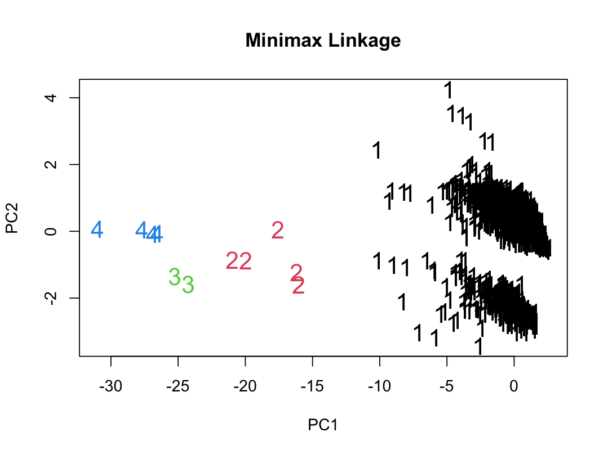 

The hierarchichal clustering plot, utilizing the minimax linkage function, plots each data point using a number and color, which denotes its cluster assignment. Similar to the K-Means Cluster plot, the data is plotted against the first two principal components, and produces similar results to that of the K-Means clustering approach. That is, that the first principal component appears most significant in clustering the data. Furthermore, the minimax linkage function produces clusters that are distinct and separate from one another when plotted using the first two principal components, suggesting that this is a useful method in grouping observations in the data. 

#### II. **Boxplots of Clusters**:  

Based on the fact that the first principal component is significant in clustering the observations in the data, boxplots were created to further analyze and visualize the distribution of PC1's contribuitong variables between each cluster. 

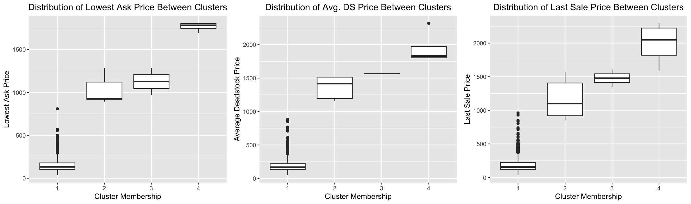 

These boxplots display the distribution of the `lowestAsk`, `AvgDSPrice`, and `lastSale` variables between each of the four clusters. For all three variables (boxplots), the median values, as well as the interquartile ranges, are signfiicantly different from one another. In all three plots, cluster 1 is associated with the lowest value of the y-variable, followed by cluster 2, cluster 3, and cluster 4 is associated with the largest values of the y-variable. This further illustrates that these three variables (that largely contribute to the first principal component) are significant in determining the cluster assignment for this data. 

## Next Steps 

Feel free to check out the [Conclusions](conclusion.md) section for key findings, limitations, and directions for future research! 

   

